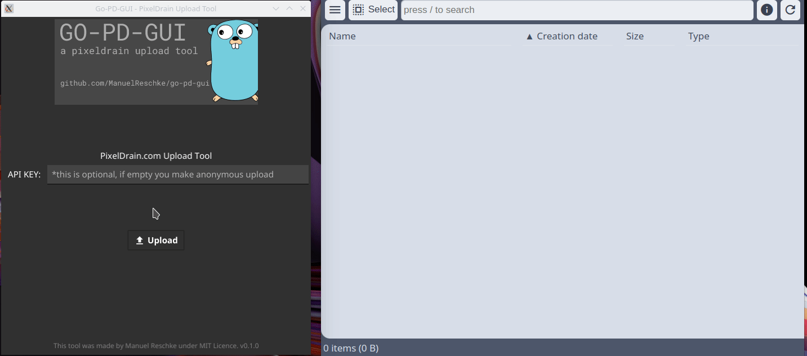

# Go-PD-GUI -DRAINY
A free easy to use cross plattform upload tool for pixeldrain.com.

## Preview

## Download binaries
Binaries for Windows, Linux and Android are available under the /fyne-cross folder.

* Windows:
  * [Windows 64 Bit](https://github.com/ManuelReschke/go-pd-gui/blob/main/fyne-cross/bin/windows-amd64/DRAINY.exe?raw=true)
  * [Windows 32 Bit](https://github.com/ManuelReschke/go-pd-gui/tree/main/fyne-cross/bin/windows-386/DRAINY.exe?raw=true)
* Linux:
  * [Linux 64 Bit](https://github.com/ManuelReschke/go-pd-gui/blob/main/fyne-cross/bin/linux-amd64/DRAINY?raw=true)
* Android:
  * [Android-ARM64](https://github.com/ManuelReschke/go-pd-gui/blob/main/fyne-cross/dist/android-arm64/DRAINY.apk?raw=true)
  * [Android-ARM](https://github.com/ManuelReschke/go-pd-gui/blob/main/fyne-cross/dist/android-arm/DRAINY.apk?raw=true)

### Features:

* upload to pixeldrain
* support auth via API-Key (*optional)
  * save and load API-Key from user settings
* output file url
* "Copy" button to copy link easily

## License

This software is released under the MIT License, see LICENSE.